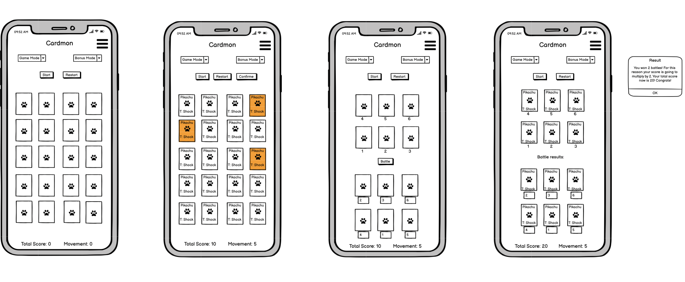

# Cardmon Memory Game

The idea of this project is to practice the knowledge learned so far about the interactive frontend module of the Code Institute software development course.
 
In this module was presented the javascript main aspects, exercises and at the end of this module this project was created to put in practice the concepts learned at this point.
 
This project borned from my personal attraction for games such as Pokemon and my curiosity to understand a bit more of how they are made. Also I decided to build this memory game utilising Pokemon API and just vanilla javascript. In that way I practise how to interact with API and how to construct the logic of this game practising the fundamental parts of javascript as the interaction with array and objects, manipulation of the DOM, event listers and some lops.
 
## Table of Contents
1. [UX](#UX)
    1. [User Stories](#user-stories)
    1. [Wireframe](#wireframe)
1. [Features](#features)
    1. [Existing Features](#existing-features)
    1. [Features Left To Implement](#features-left-to-implement)
1. [Technologies Used](#technologies-used)
1. [Responsiveness of Pages](#responsiveness-of-pages)
1. [Testing](#testing)
    1. [Notable Bugs](#notable-bugs)
1. [Deployment](#deployment)
    1. [Making a Local Clone](#making-a-local-clone)
1. [Credits](#credits)
    1. [Content](#content)
    2. [Media](#media)
    3. [Acknowledgements](#acknowledgements)

## UX
 
The UX was idealized to be simple and not distractive, keeping the attention of the user to the functionality of the game. However, it is important to accommodate the functionality at the same time that the visuals maint the main idea of the application. After a search period and taking in consideration the user stories it was decided to borrow the palette's colors from the classic Game-boy, bringing a certain feeling of nostalgia and the connection with the main user of this application.

Embeded with this concept and the user stories was possible to formulate the framework.

### User Stories

#### External user’s goal
Have fun playing a memory card game themed with Pokemon within a iteractive interface. 

#### Site owner's goal
Make the game fun and simple by allowing everyone to play a visually satisfying experience.

### Wireframe

In result of the above, the concept of the game was created taking in consideration some research and the user stories. The wireframe keep things simple but add a simple touch of nostalgia trying to attach an attractiveness with the basic functionality of this game.

The initial idea was to create the memory game and build on it another phase called battle mode, which is predefined in this wireframe. However, it was not possible to implement the bonus mode due to lack of time.

The initial wireframe basically consist: 

1. Navbar with three options - Home, Rules and About it.
2. Button to select level and one to select the option yes or no for the battle mode afterwards.
3. Three buttons to interact with major commands - Start, Restart and confirm selection.
4. The grid with the 20 cards.
5. At the end the score and the number of movements.

Desktop Version

Tablet Version

Mobile Version

## Features

The initial suffered some changes becoming more simple to execute due the lack of time. Below all the functionalities and parts that were not possible to implement will be better explained.
 
1. Navbar;

2. Buttons for control;
    
3. Grid systems;

4. The cards;

5. Scores;
    
### Existing Features

#### Navbar
- The **Navbar** utilized came from bootstrap and was eddited in the visual to match the visual identity of the project. In this feature is possibleto find the links for home, rules and abou it. 

#### Buttons for control
- Those **buttons** will control those button the main actions of the game.
    - The start will requeste the information from the api and prepare the cards.
    - The restart button will refresh the page.
    - The shuffle it is way to get more difficult mixing the cards more.

#### Grid systems
 - The **grid systems** was

#### Cards
 - In **cards** is 

#### Scores
 - The **scores** is

#### Footer
- **Footer** was developed to match the main visual aspects of the website and provide a link to website home and social links of the Xbox brand.

### Features Left to Implement

 
### Existing Features
- Feature 1 - allows users X to achieve Y, by having them fill out Z
- ...

For some/all of your features, you may choose to reference the specific project files that implement them, although this is entirely optional.

In addition, you may also use this section to discuss plans for additional features to be implemented in the future:

### Features Left to Implement
- Another feature idea

## Technologies Used

All the Technologies utilised to built this landing page can be found bellow with the respective links.

### Languages
- [HTML](https://en.wikipedia.org/wiki/HTML) to build the whole structure of the landing page.
- [CSS](https://en.wikipedia.org/wiki/CSS) to style all the webiste.
- [JavaScript](https://en.wikipedia.org/wiki/JavaScript) to build the majority of the interactions and the logical for this game.

### Frameworks and others

- [Gitpod](https://www.gitpod.io/) as the code editor.
- [Bootstrap 5.0](https://getbootstrap.com/docs/5.0/getting-started/introduction/) for all the core HTML sctrucutes as for buttons, navbar, grid system and helpers to deal with less unique CSS rules and more solutions pre built.
- [Google Fonts](https://fonts.google.com/) for both fonts utilised in the project.
- [Git](https://git-scm.com/) was used as tool to control the version of the project.
- [Git Hub](https://github.com/) to store the project with versionament control
- [Github pages](https://pages.github.com/) to deploy the live project.
- [Balsamiq](https://balsamiq.com/) to wireframe the ideia of the website.
- [Am I responsive](http://ami.responsivedesign.is/#) to help visualize the webiste in different screens sizes and get a print of it.
- [PokeAPI](https://pokeapi.co/) was responsible for all the request about Pokemon utilised in the cards. 

## Testing

In this section, you need to convince the assessor that you have conducted enough testing to legitimately believe that the site works well. Essentially, in this part you will want to go over all of your user stories from the UX section and ensure that they all work as intended, with the project providing an easy and straightforward way for the users to achieve their goals.

Whenever it is feasible, prefer to automate your tests, and if you've done so, provide a brief explanation of your approach, link to the test file(s) and explain how to run them.

For any scenarios that have not been automated, test the user stories manually and provide as much detail as is relevant. A particularly useful form for describing your testing process is via scenarios, such as:

1. Contact form:
    1. Go to the "Contact Us" page
    2. Try to submit the empty form and verify that an error message about the required fields appears
    3. Try to submit the form with an invalid email address and verify that a relevant error message appears
    4. Try to submit the form with all inputs valid and verify that a success message appears.

In addition, you should mention in this section how your project looks and works on different browsers and screen sizes.

### Notable Bugs
You should also mention in this section any interesting bugs or problems you discovered during your testing, even if you haven't addressed them yet.

If this section grows too long, you may want to split it off into a separate file and link to it from here.

## Deployment

For deploy this project I utilised some of the mentioned technologies above to facilated this process.

1. The first step were created a repository on GitHub with the name **cardmon-milestone-2**
2. Installed the **Gitpod** extension for **Google Chrome**;
3. Linked **Gitpod** gaving **access** to my **GitHub profile** with my login and password;
4. After that all repositories started to showed the **Gitpod button** just next to the button Code.
5. Clicking in the **Gitpod button** you have access to the code editor linked with this repository.
6. After editing the code it was possibble utilising **Git command** (status, add, commit and push) in the **terminal** updated Github repository.
7. To deploy was necessary went to repository settings and scrolled down untill the options Github pages **check it out here!**
8. In the link it was necessary went to option **source** and selected the main branch
9. After that I clicked on the button **save**.
10. Finally after those steps the link of the webiste was ready to be utilised and the project is live.

### Making a Local Clone

1. Log in to your [GitHub](https://github.com/), locate the repository [pedromn0/cardmon-milestone-2](https://github.com/pedromn0/cardmon-milestone-2).
2. Inside the repository locate the button Code and then click on "Clone or download".
3. To clone the repository using HTTPS, under "Clone with HTTPS", copy the link.
4. In your terminal open Git Bash
5. Then you can change the current working directory to a directory that suits you in your computer.
6. Type `git clone`, and then paste the URL you copied earlier.

## Credits

### Content
- The text for section Y was copied from the [Wikipedia article Z](https://en.wikipedia.org/wiki/Z)

### Media
- The photos used in this site were obtained from ...

### Acknowledgements

- I received inspiration for this project from X