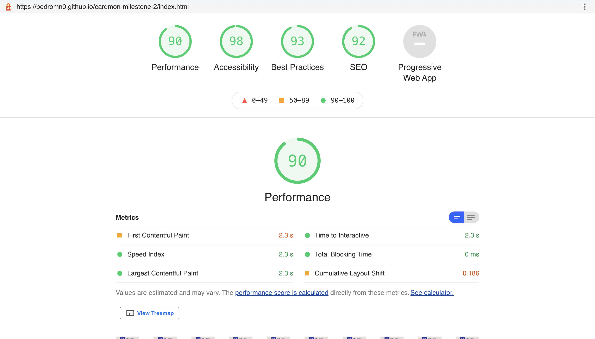
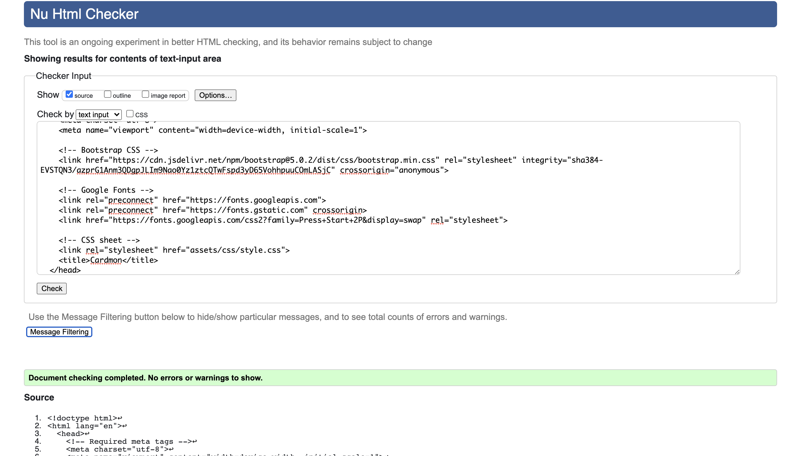
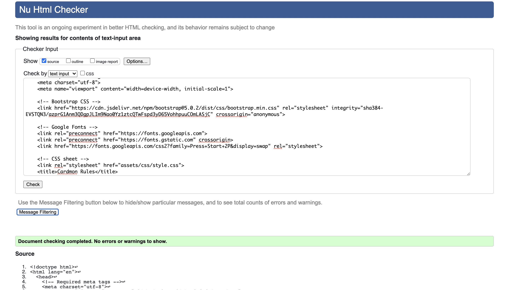
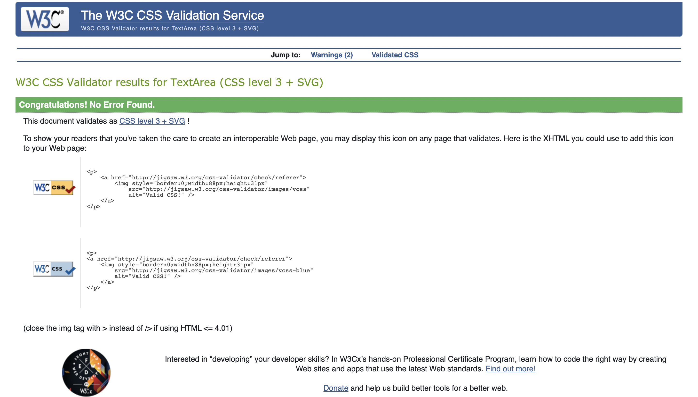
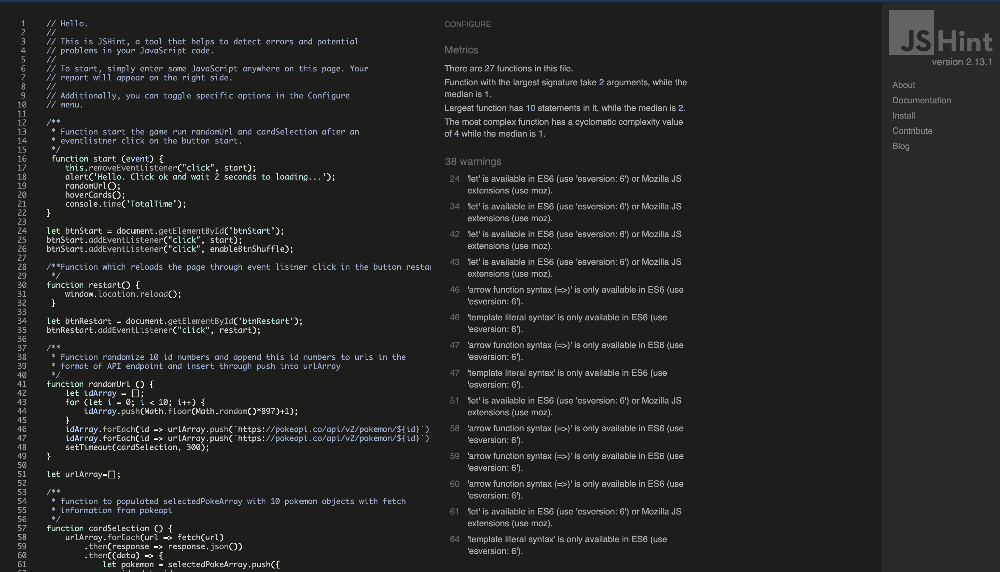

# Cardmon Memory Game


[Live project link](https://pedromn0.github.io/cardmon-milestone-2/)

The idea of this project is to practice the knowledge learned so far about the interactive frontend module of the Code Institute software development course.
 
In this module was presented the javascript main aspects, exercises and at the end of this module this project was created to put in practice the concepts learned at this point.
 
This project borned from my personal attraction for games such as Pokemon and my curiosity to understand a bit more of how they are made. Also I decided to build this memory game utilising Pokemon API and just vanilla javascript. In that way I practise how to interact with API and how to construct the logic of this game practising the fundamental parts of javascript as the interaction with array and objects, manipulation of the DOM, event listers and some lops.
 
## Table of Contents
1. [UX](#ux)
    1. [User Stories](#user-stories)
    1. [Wireframe](#wireframe)
1. [Features](#features)
    1. [Existing Features](#existing-features)
    1. [Features Left To Implement](#features-left-to-implement)
1. [Technologies Used](#technologies-used)
1. [Testing](#testing)
    1. [Mannual Tests and Notable Bugs](#mannual-tests-and-notable-bugs)
        - [More than three clicks](#more-than-three-clicks)
        - [Shuffle at any time](#shuffle-at-any-time)
    1. [Responsiveness](#responsiveness)
1. [Deployment](#deployment)
    1. [Making a Local Clone](#making-a-local-clone)
1. [Credits](#credits)
    1. [Content](#content)
    2. [Media](#media)
    3. [Acknowledgements](#acknowledgements)

## UX
 
The UX was idealized to be simple and not distractive, keeping the attention of the user to the functionality of the game. However, it is important to accommodate the functionality at the same time that the visuals maint the main idea of the application. After a search period and taking in consideration the user stories it was decided to borrow the palette's colors from the classic Game-boy, bringing a certain feeling of nostalgia and the connection with the main user of this application.

<p align="center">

</p>

Embeded with this concept and the user stories was possible to formulate the framework.

### User Stories

#### External user’s goal
Have fun playing a memory card game themed with Pokemon within a iteractive interface. 

#### Site owner's goal
Make the game fun and simple by allowing everyone to play a visually satisfying experience.

### Wireframe

In result of the above, the concept of the game was created taking in consideration some research and the user stories. The wireframe keep things simple but add a simple touch of nostalgia trying to attach an attractiveness with the basic functionality of this game.

The initial idea was to create the memory game and build on it another phase called battle mode, which is predefined in this wireframe. However, it was not possible to implement the bonus mode due to lack of time.

The initial wireframe basically consist: 

1. Navbar with three options - Home, Rules and About it.
2. Button to select level and one to select the option yes or no for the battle mode afterwards.
3. Three buttons to interact with major commands - Start, Restart and confirm selection.
4. The grid with the 20 cards.
5. At the end the score and the number of movements.

Desktop Version
<p align="center">

</p>

Tablet Version
<p align="center">

</p>

Mobile Version
<p align="center">

</p>

## Features

The initial design suffered some changes becoming simpler to facilitate the implementation of the game. Below are all the functionalities and parts that were possible and not to implement.
 
1. Navbar;

2. Buttons for control;
    
3. Grid systems;

4. The cards;

5. Scores;
    
### Existing Features

#### Navbar
- The **Navbar** utilized came from bootstrap and was eddited in the visual to match the visual identity of the project. This feature allows the user reach links for home, rules and abou it.

    - The **Rules** is a page to explain the simple rules of this game.

    - The **About it** it is a briefly explanation of the concept of this project and a link to the github repository.  

    - Those **buttons** will give the control of the game.
        - Clicking on the start will begins the flow of funcitons from request the Pokemon informations with the API until manipulate the DOM and display the cards.
        - Clicking on restart button will refresh the page and start all over.
        - Clicking the shuffle button will give a better mix on the cards to guarantee more difficult.

#### Grid systems
 - The **grid systems** came from the bootstrap to ease the structural part leaving more time for the functional part of the game. The collumns and rows were utilised to comprehend more cards into the same display resulting in 5 cards per row in bigger screens where this game was conceived to be played.

#### Cards
 - The **cards** utilised came from bootstrap as well but they were heavily personalised to fit the project criteria’s. Each card is composed for different HTML elements such as:
    - frontFace container in which is contained the image or sprite from Pokemon API.
    - card-body container in which is contained one "h5" tag for the Pokemon name and an "p" tag for the type of the Pokemon request from the API.
    - backface container which is the red part of the card which it is removed after clicking on it.    

#### Scores
 - The **scores** works to countability the number of wrong moves and the number of paired cards found.
    - **Pairs found** increments every two correct cards found by the user at the maximum of 10 because the total of cards are 20.
    - **Movements** increments every two incorrect selection to this score. The less the better.

### Features Left to Implement
- The second phase of the game called battle mode was not possible to implement due the lack of time. The battle mode would consist of after the memory game the user would select six Pokemon from the pool available from the already finished memory game. With this selection of 6 Pokemon the program would randomly choose the equivalent number of Pokemon (6). The user would select the order of reveal of 6 Pokemon and then the disclose or battle between the types would occur one by one (fire vs water). The number of victorious Pokemon would multiply the score of the user.

## Technologies Used

All the Technologies utilised to built this landing page can be found bellow with the respective links.

### Languages
- [HTML](https://en.wikipedia.org/wiki/HTML) to build the whole structure of the landing page.
- [CSS](https://en.wikipedia.org/wiki/CSS) to style all the webiste.
- [JavaScript](https://en.wikipedia.org/wiki/JavaScript) to build the majority of the interactions and the logical for this game.

### Frameworks and others

- [Gitpod](https://www.gitpod.io/) as the code editor.
- [Bootstrap 5.0](https://getbootstrap.com/docs/5.0/getting-started/introduction/) for all the core HTML sctrucutes as for buttons, navbar, grid system and helpers to deal with less unique CSS rules and more solutions pre built.
- [Google Fonts](https://fonts.google.com/) for both fonts utilised in the project.
- [Git](https://git-scm.com/) was used as tool to control the version of the project.
- [Git Hub](https://github.com/) to store the project with versionament control
- [Github pages](https://pages.github.com/) to deploy the live project.
- [Balsamiq](https://balsamiq.com/) to wireframe the ideia of the website.
- [Am I responsive](http://ami.responsivedesign.is/#) to help visualize the webiste in different screens sizes and get a print of it.
- [PokeAPI](https://pokeapi.co/) was responsible for all the request about Pokemon utilised in the cards. 

## Testing

The automated test utilised were [Google Lighthouse](https://developers.google.com/web/tools/lighthouse) to test general performance, [W3C Markup](https://validator.w3.org/nu/) validation service for the find any inconsistency in the HTML and  [W3C Jigsaw CSS](https://jigsaw.w3.org/css-validator/#validate_by_input) validation service for CSS and [Jshin](https://jshint.com/) for JavaScript.

All the possible erros founded by W3C validators were corrected less those ones being part of bootstrap Frameworks. The same can be said by the Jshin valitadion where there were no errors being displayed.

All the results can be seeing below.

Google Lighthouse results:
<p align="center">

</p>

W3C Markup for index.html results:
<p align="center">

</p>

W3C Markup for rules.html results:
<p align="center">

</p>

W3C Markup for about.html results:
<p align="center">

</p>

W3C Jigsaw CSS for style.css results:
<p align="center">

</p>

Jshin for script.js results:
<p align="center">

</p>

### Mannual Tests and Notable Bugs
The website was manually tested to check if it was working properly. After success attempts I can confirm in the best of my capabilities that the website is working as initially was intend. 

#### More than three clicks
The game provides the capacity to interact with the user through clicking on the cards revealing their content and then checking the value of the cards. If the chosen one is right then will increment one point in the score, but if the selection was wrong the increment will happen in the movements indicating that this selection was wrong. Other than that if the selection was right the user will receive the visual feedback of the cards maintained it revealed, otherwise those cards will be hidden again indicating for the user that they need to try again.

1. All that was tested following the regular flow:
   1. Start the game
   2. Wait two seconds for all cards being loaded
   3. Click on two whised cards and then wait for the visual feedback and increment on the scores or movements.
 
One error found during these tests and already addressed was related to the capacity of the user clicks three or more cards. In that way the logic of the game would be broken resulting in a wrong incrementation of the scores and revealing more than two cards which is not allowed.
 
To solve that was utilised an logic to give boolean value for a global variable called **lockBoard** of false. In the first if statement it is checked if this is true and the function will return and stop the sequence to go on revealing more cards. If the value is false it will go on and at the end of this function will replace the value of **lockBoard** to true for the cycle of checks could happen again.

```
function matchCards (event) {
     if (lockBoard) return;
     if (this === firstCard) return;

    this.classList.remove('backFace');
        
    
     if (!flippedCard) {
         flippedCard = true;
         firstCard = this;
         return;
     }
 
     secondCard = this;
    lockBoard = true;
             
     checkForMatch(firstCard, secondCard);
 }
```
This segment of logic goes on and at the very end where all the variable values were reinstated to the initial states trough the function **resetBoard** to makes the whole sequece works again.

```
function resetBoard() {
    [flippedCard, lockBoard] = [false, false];
    [firstCard, secondCard] = [null, null];
} 
```

#### Shuffle at any time

Another test being executed was to guarantee once more that the logic of the game would not be broken. In this case it is related to the shuffle button that remixes the pokemon array of objects coming from the API through the fetching. This is a feature to guarantee a better mix.

```
function randomPokeArray(event) {
    selectedPokeArray.sort(() => Math.random() - 0.5);
     setTimeout(displayPokeInfo, 200);
}

let btnShuffle = document.getElementById('btnShuffle');
btnShuffle.addEventListener("click", randomPokeArray,randomPokeArray);
```

2. The test consisted in
   1. Start the game
   2. Wait two seconds for all cards being loaded
   3. After that click on the shuffle button.

That made me realize that I was guaranteeing to the user the possibility to change the order of the cards at any time of the game, even after the matching of pairs. That in this case would be breaking the game of increment points for cards that could not be the same any more because the shuffle will make that cards change information and not the position. In this case was possible to for example have a pair of charizard and then click on shuffle and that two cards being displayed as Squirtle and bulbasaur for example.

To avoid that the solution was creat a check attached to the event listener click that would be analysing how many pairs were found through the element where the increment of pair were registered and then being more than 0 the function itself called **disabledBtnShuffle** would be disabling the shuffle button.

```
function enableBtnShuffle(event) {
    btnShuffle.removeAttribute("disabled", "");
}

function disabledBtnShuffle (event) {
    if (parseInt(document.getElementById("score").innerText) > 0){
        btnShuffle.setAttribute("disabled", "")
    }
}
```

Following the same and avoid the shuffle button being displayed before the game could run a similar logic was created. It was given to the html of the button to shuffle the attribute disabled. With that and after listening a event on the button start the function ***enableBtnShuffle** will remove that attribute enabling the button.

```
function enableBtnShuffle(event) {
    btnShuffle.removeAttribute("disabled", "");
}
```

Those two sequences of logic give the button the appropriate functionality to allow the function shuffle just happens up to the moment that the user finds the first pair of cards.

This game or website does not provide any console error because all of them were corrected before the submission.

### Responsiveness

This project was developed to work majority in bigger screens due to the nature of the game. It is memory game that in essence requires a bigger screen to guarantee a better experience to the user. However the project is responsive to all screens adapting the number of cards as better as possible, but the best experience will be achive on desktop and tablets.

As explained this project will work fine in at least 3 different sizes Desktop,Tablet and mobile. To achive this the website has been tested on several possible devices, from 11 "or 13" inch Macs, Google Chrome developer tools, variable Android phones of friends and relatives.

## Deployment

For deploy this project I utilised some of the mentioned technologies above to facilated this process.

1. The first step were created a repository on GitHub with the name **cardmon-milestone-2**
2. Installed the **Gitpod** extension for **Google Chrome**;
3. Linked **Gitpod** gaving **access** to my **GitHub profile** with my login and password;
4. After that all repositories started to showed the **Gitpod button** just next to the button Code.
5. Clicking in the **Gitpod button** you have access to the code editor linked with this repository.
6. After editing the code it was possibble utilising **Git command** (status, add, commit and push) in the **terminal** updated Github repository.
7. To deploy was necessary went to repository settings and scrolled down untill the options Github pages **check it out here!**
8. In the link it was necessary went to option **source** and selected the main branch
9. After that I clicked on the button **save**.
10. Finally after those steps the link of the webiste was ready to be utilised and the project is live.

### Making a Local Clone

1. Log in to your [GitHub](https://github.com/), locate the repository [pedromn0/cardmon-milestone-2](https://github.com/pedromn0/cardmon-milestone-2).
2. Inside the repository locate the button Code and then click on "Clone or download".
3. To clone the repository using HTTPS, under "Clone with HTTPS", copy the link.
4. In your terminal open Git Bash
5. Then you can change the current working directory to a directory that suits you in your computer.
6. Type `git clone`, and then paste the URL you copied earlier.

## Credits

All the images of pokemon and information utilised for this project were from [PokeAPI](https://pokeapi.co/).

A significant part of the logical and attempt to block the board of the game came from this project from **Marina Ferreira** and can be accessed from [here](https://marina-ferreira.github.io/tutorials/js/memory-game/). This code was edited and adapted to meet my project criteria.

The function responsible to fetch information from API, organize in objects then insert those objects in arrays had inspiration from [this video](https://www.youtube.com/watch?v=T-VQUKeSU1w) but the code had to be edited to works in accordance with my project criteria. The author of the original code is **James Q Quick**.

The button shuffle contains an function called ramdomPokeArray that was inspired but edited from this [source](https://flaviocopes.com/how-to-shuffle-array-javascript/) from **Flavio Copes**.

### Content
- All the contend of this website was created for myself except for all the information presented on the cards that has their source from [PokeAPI](https://pokeapi.co/). 

### Media
- The images from all Pokemon come from [PokeAPI](https://pokeapi.co/).

- The Pokeball image utilised called [pokeLogo](https://www.pikpng.com/pngvi/xxRxTm_brik-pixel-art-pokemon-pokeball-clipart/) in the project came from this website https://www.pikpng.com/

### Acknowledgements

- The inspirations for this project was no special game or website to be mentioned here but all memory cards games already played by me.